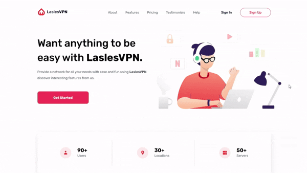

# 🌐 LaslesVPN Landing Page

A modern and responsive landing page built with **HTML5** and **SCSS (BEM methodology)**.  
This project focuses on clean code, responsive design, and user-friendly navigation (including a custom-built mobile hamburger menu).

---

## 📸 Preview

---

## 🚀 Live Demo
👉 [Click here](https://gamalhafez.github.io/LaslesVPN-landing-page/)  

---

## ✨ Features
- Responsive layout for small and large screens  
- Sticky header with smooth navigation  
- Mobile hamburger menu (pure CSS + HTML)  
- Clean SCSS architecture (mixins, variables, components)  
- Hover and transition effects for better UX  
- Accessible markup with semantic HTML

---

## 🛠️ Tech Stack
- **HTML5**  
- **SCSS** (BEM + custom mixins)
